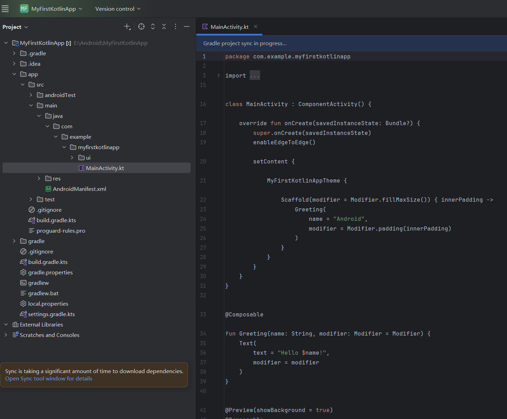
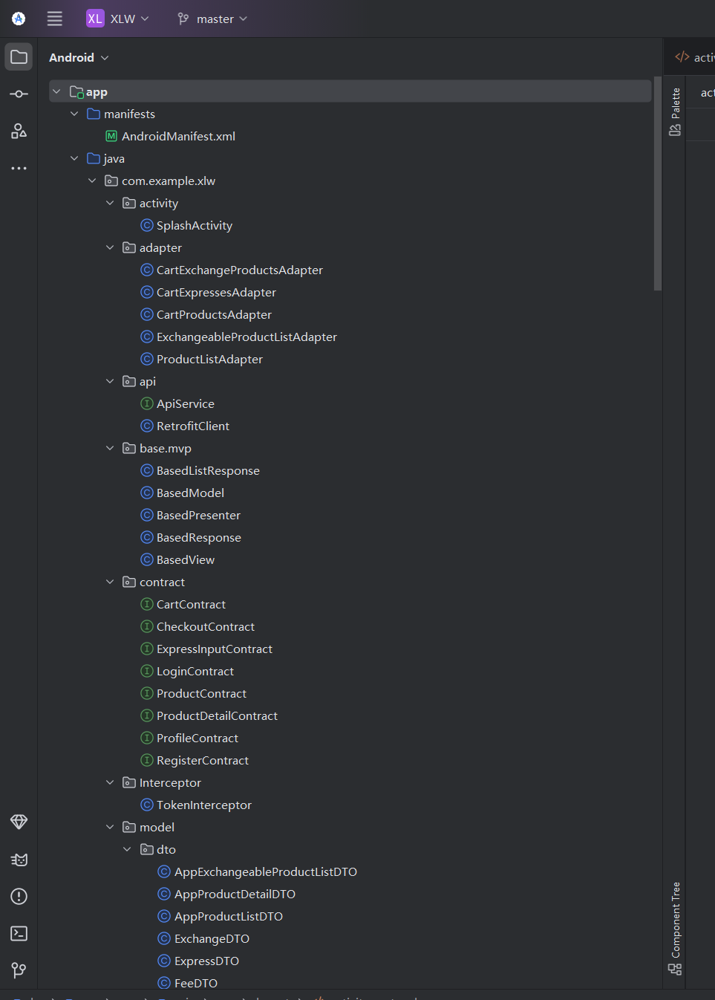

### 实验2-2
## 任务一：按照教程完成首个Kotlin APP的构建
按照流程创建项目

## 任务二：按照教程完成Compose布局的实践
选择Phone and Tablet选项卡中Empty Activity，将工程命名为BasicsCodelab。
为Greeting 设置不同的背景色，为默认修饰符添加内边距修饰符：modifier.padding(24.dp)。
创建一个MyApp 的可组合项，该组合项中包含Greeting。
创建Compose中的列（Column）和行（Row）使用循环向Column中添加元素向，Greeting 添加可点击元素，因此需要先添加对应的按钮。

## 任务三：完成面向AI应用的Compose布局
这个任务在分支4，因为和任务二的项目在一起不好传
