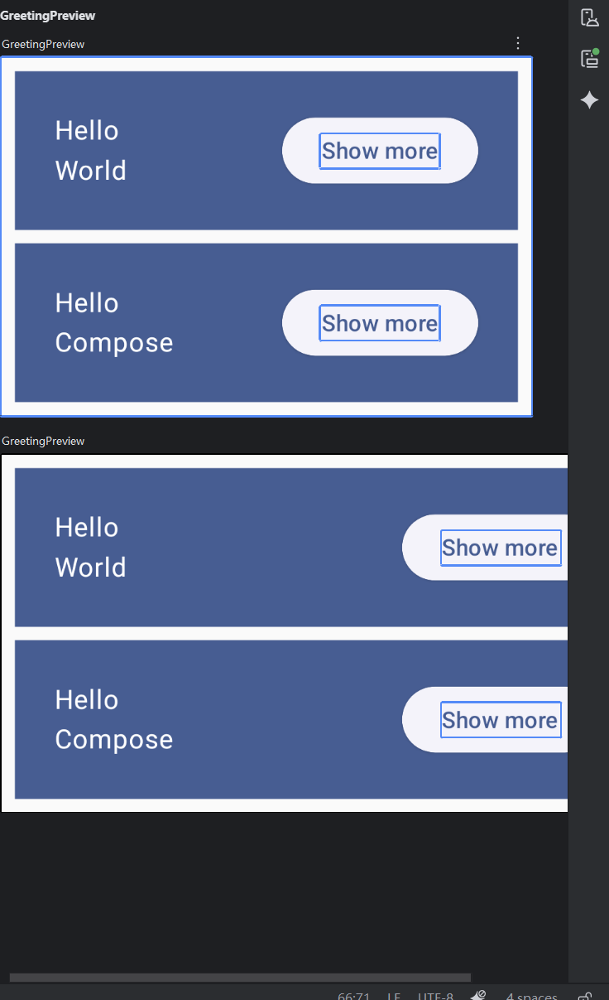
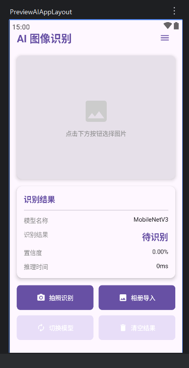

# 构建Kotlin应用并使用Compose布局
## 任务一：按照教程完成首个Kotlin APP的构建
按照教材创建首个Kotlin APP

## 任务二：按照教程完成Compose布局的实践
按照教程实现compose的布局

## 任务三：完成面向AI应用的Compose布局
设计并实现一个面向 AI 图像识别应用的 Android Compose 界面，该界面能够：

- 展示相机预览区域
- 显示识别结果信息
- 提供用户操作按钮
- 实现界面状态管理
