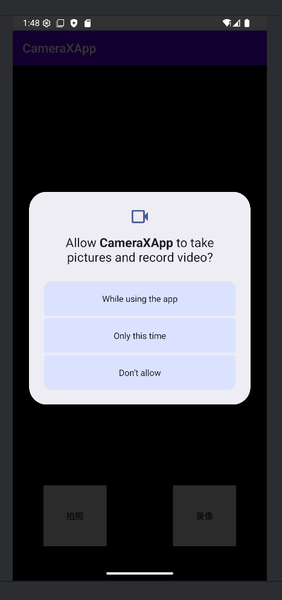
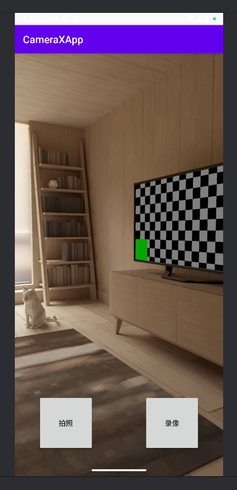
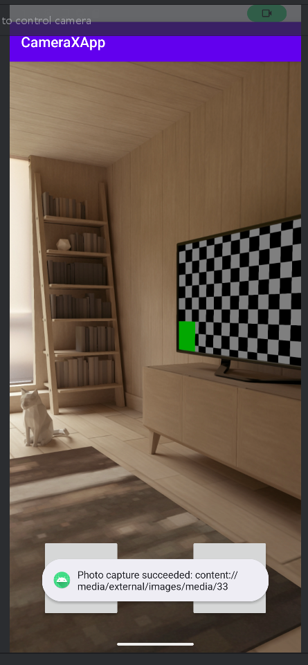
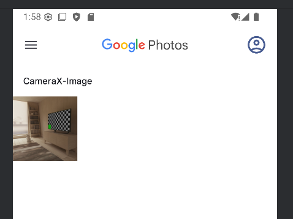

# 构建Android CameraX应用
实验目的
掌握Android CameraX拍照功能的基本用法.由于CameraX是开发智能应用的必要组件,本次实验十分必要。
掌握Android CameraX 视频捕捉功能的基本用法
进一步熟悉Kotlin语言的特性
## 实验内容
CameraX是Android最新的支持开发相机应用的Jetpack库
先实现基本页面

实现拍照功能

当你点击按钮后的反应

图片保存到媒体库
