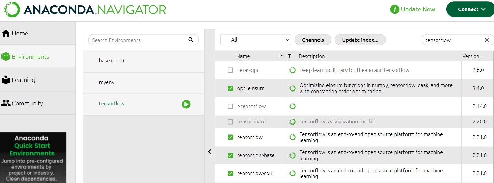
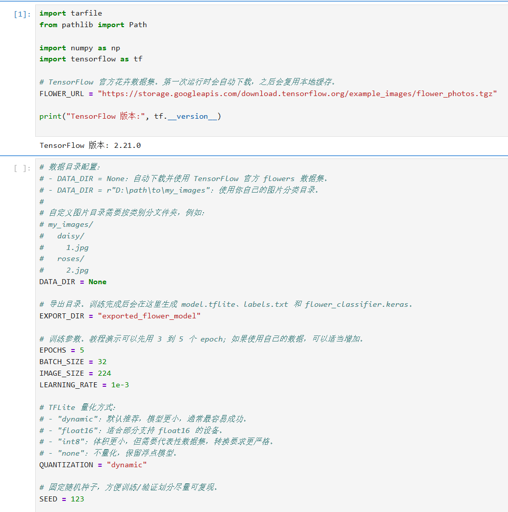
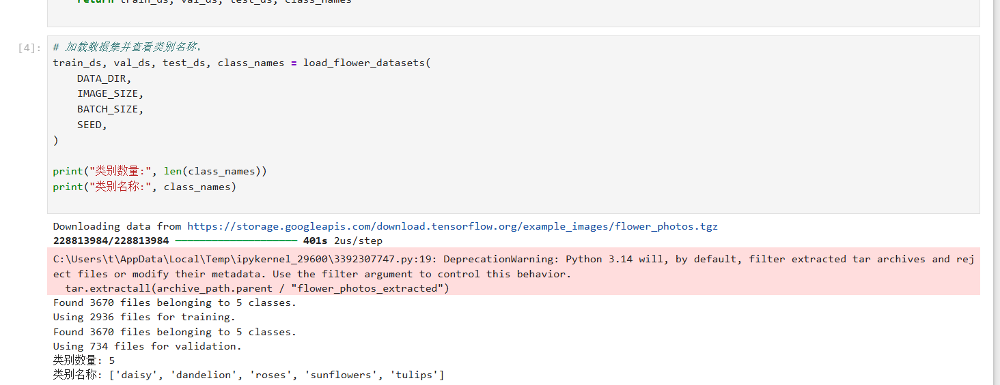
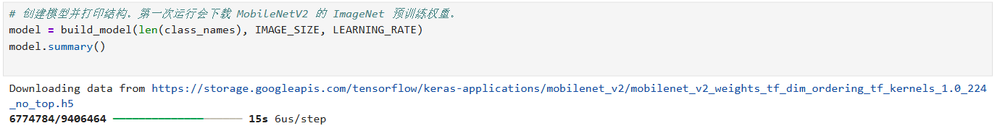
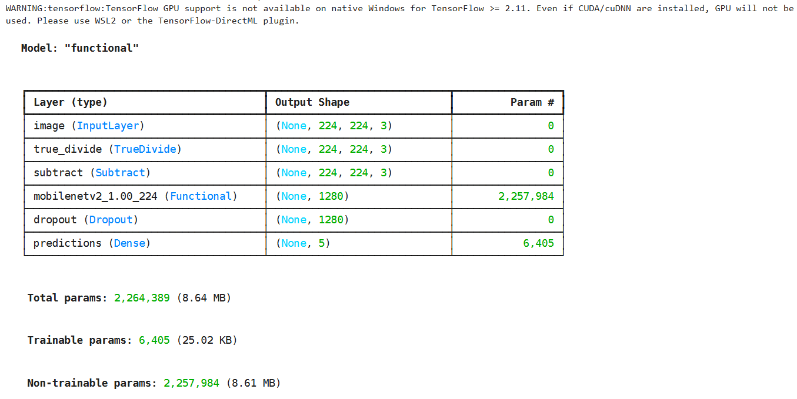
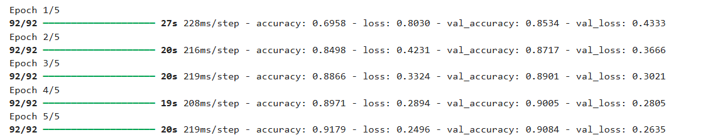
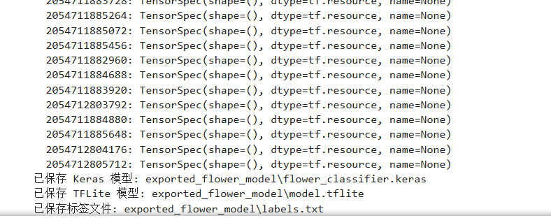

# 实验五-1-TensorFlow花卉图片分类器模型训练
## 花卉图片分类器：Keras 训练并导出 TFLite
1. 安装依赖
   使用Anaconda创建一个新的环境进行安装
   
   此外完成了将新的环境注册新的注册为 Jupyter Notebook 的内核
2. 导入库并设置参数
   
   输出TensorFlow 版本: 2.21.0
3. 读取并划分数据集
   
   输出Found 3670 files belonging to 5 classes.
Using 2936 files for training.
Found 3670 files belonging to 5 classes.
Using 734 files for validation.
类别数量: 5
类别名称: ['daisy', 'dandelion', 'roses', 'sunflowers', 'tulips']
4. 构建并训练 Keras 模型
   第一次创建模型
   
   
   开始训练
   
   使用测试集去评估模型
   返回输出：test_loss=0.3313, test_accuracy=0.8892
5. 转换为 TensorFlow Lite 模型
   
6. 简单测试导出的 TFLite 模型
   返回输出
   ```text
   真实类别=daisy, 预测类别=daisy
   真实类别=tulips, 预测类别=tulips
   真实类别=sunflowers, 预测类别=sunflowers
   真实类别=daisy, 预测类别=daisy
   真实类别=sunflowers, 预测类别=sunflowers
   ```


   