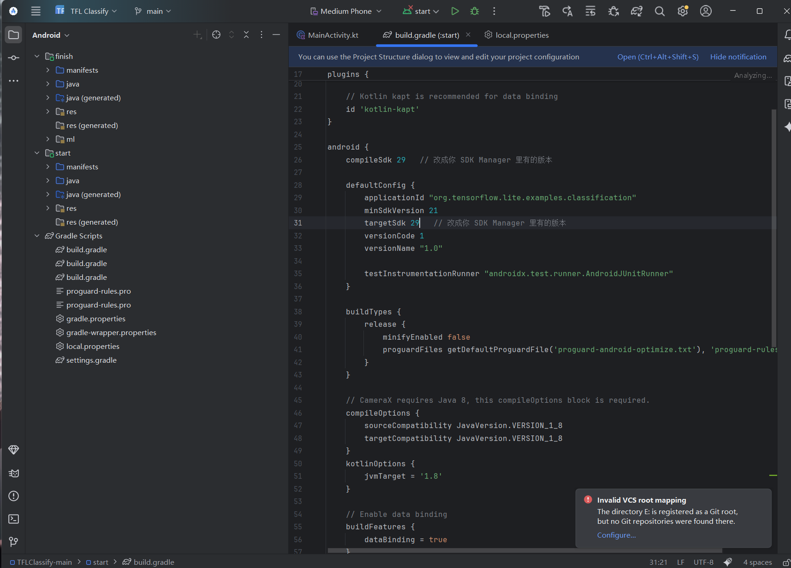
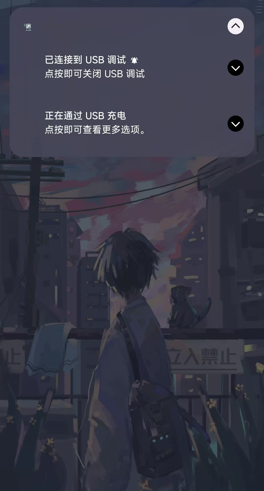
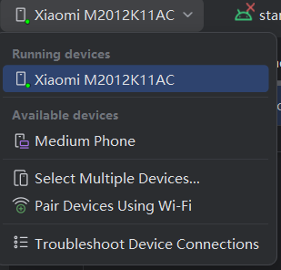
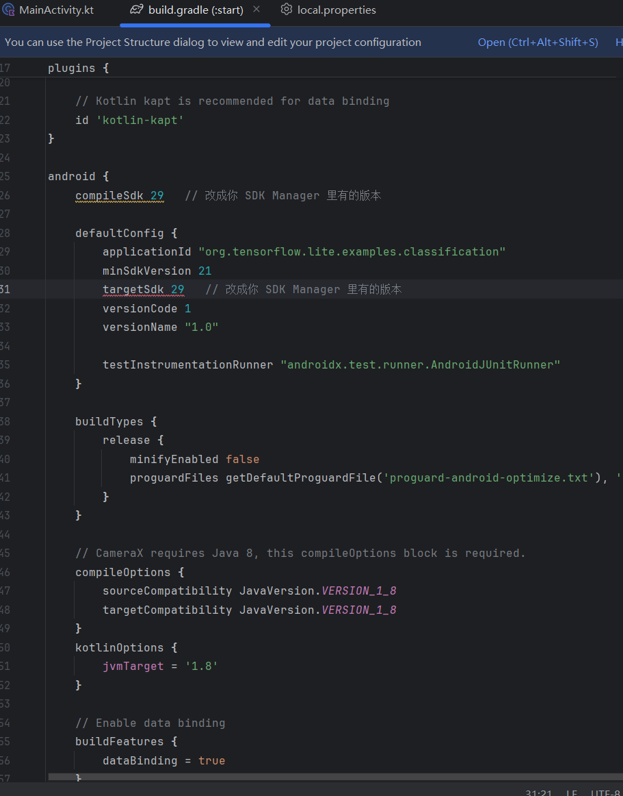

# 实验四-实现智能图像分类APP
1.clone项目

2.连接真实手机

3.编译
我先是能解决编译问题，但是到下一步的运行发现了问题，strat的模块提示没有设置sdk的路径，排查后发现问题在strat的build.gradle的语法过期。于是调整语句

发现Android的经典问题，Java JDK的版本过高，于是调整至Java11，然后就是Android Gradle插件版本太旧，无法识别 compileSdk 34。选择降级 compileSdk 版本后还是不停的出错，于是选择升级 Android Gradle 插件，但是发现耗费了一天的时间在不停的换gradle版本后，决定放弃。
这个项目太久远了，版本之间的冲突，加上旧版本被淘汰，这是我对于这个实验的总结。